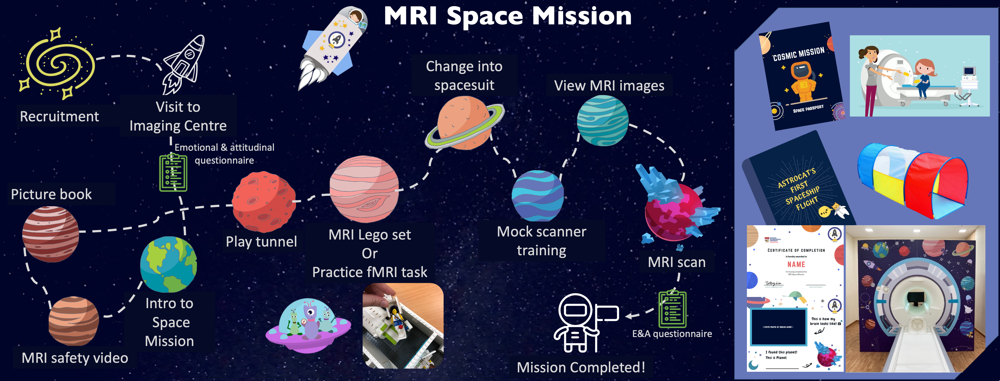

# MRI-Space-Mission
## MRI Space Mission: A Stepwise Paediatric MRI Training Protocol for Young Children
The MRI Space Mission is a child-centred, stepwise paediatric MRI training protocol for young children. The protocol consists of a series of mini-activities that are designed to familiarize young children with the MRI scanner and scanning procedures. Children will be introduced to MRI through reading a picture book, watching videos, and playing games. The paediatric MRI training protocol has been tested with children aged 5 to 8 years old at Nanyang Technological University in Singapore from 2021 to 2026. Our space-themed MRI training protocol was verified to be feasible and effective for children. Successful scan rates were quantified for each imaging sequence according to predefined quality-control criteria, and emotional and attitudinal responses were collected from both children and their parents. The protocol’s structured activities, combined with preparation and reward, effectively reduced anxiety and head motion during scanning, making paediatric MRI research more practical and reliable. However, the results also indicate that further measures may be needed to reduce head motion and improve children’s ability to remain still in future protocols.

## License
This protocol is shared under the Creative Commons Attribution 4.0 International (CC BY 4.0) license.  
You are free to use, distribute, and adapt the material, provided appropriate credit is given.

### Citation
Please cite this protocol as:

Lin, H.-Y., Wu, C.-Y., Teo, J. L., Chia, P. S. Q., Yap, M. L.-M., Yeo, M. C. L., Styles, S. J., & Chen, S.-H. A. (2026).  
**MRI Space Mission: A Stepwise Paediatric MRI Training Protocol for Young Children.** The 32nd Annual Meeting of the Organization for Human Brain Mapping, Bordeaux, France, 2026.
https://github.com/tiffanylinhy/MRI-Space-Mission

## Protocol Overview

## Video Overview
[Watch Pediatric MRI Protocol Overview](https://youtu.be/T6iyhLYey_U?si=V_QqErExIoYoyd1k)

## Protocol Access
The full protocol is available on [Protocol.io](https://www.protocols.io/private/FB0CE4D429F811F185570A58A9FEAC02).

## Materials
Data depository:  
Wu, Chiao-Yi; Teo, Jia Li; Yap, Michelle Li-Mei; Lin, Hsin-Yu; Yeo, Marilyn Cai Ling; Chia, Phoebe Si Qi; Vinas Guasch, Nestor; Chen, S. H. Annabel. (2021). **"MRI Space Mission: A Stepwise Paediatric MRI Training Protocol for Young Children."** DR-NTU (Data), V2. https://doi.org/10.21979/N9/QCVEGB  

## Poster (OHBM2026)
[View Full Poster (PDF)](AbstractPoster_MRI_Space_Mission_OHBM2026_.pdf)

## Contact
For questions or collaboration, please contact:  
[linhy@ntu.edu.sg](mailto:linhy@ntu.edu.sg)

